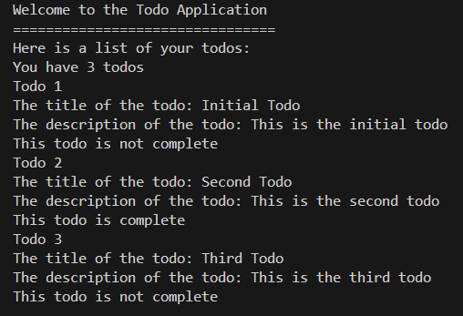

# TODO List JavaScript Project

Using the `index.js` code file, you will complete this project, which is a TODO list that uses JavaScript. It allows users to add, delete, and mark tasks as completed. The project is designed to demonstrate basic JavaScript skills. 

## Features

- **Add Tasks**: Users can add new tasks to the list.
- **Delete Tasks**: Users can remove tasks from the list.
- **Mark Tasks as Completed**: Users can mark tasks as completed.
- **Task Counter**: Displays the total number of tasks and the number of completed tasks.
- **Todo Structure**: Each todo needs a title that is a string, a description that is a string, and if it is complete which should be a Boolean. Take a look at the example for how each todo should be structured.

```JavaScript
/** 
 * Remember this is an example of what a single instance of a todo is supposed to look like
 * This is example code and you most likely won't be using this code snippet in your project
 * If you do find a use for this code snippet you are free to implement this into your project
*/
const todoStructure = {
  title: "Title Goes Here",
  description: "Description goes here",
  complete: false,
}
```

## Instructions

To get started with this project open the `index.js` code file, the starter code should look like:

```JavaScript
const todos = [
  {
    title: "Initial Todo",
    description: "This is the initial todo",
    complete: false,
  }
];

function addTodo(){}
function removeTodo(){}
function editTodo(){}
function markTodoComplete(){}
function displayTodoLength(){}

function app(){
  console.log('Welcome to the Todo Application');
  console.log('================================');
  // You will need to call your methods below this comment to edit the todos array

  // You will need to call your methods above this comment to edit the todos array
  console.log('Here is a list of your todos:');
  // Print the length of the todos array below this comment

  // Print the length of the todos array above this comment
  // Iterare over the todos array and console.log each todo below this comment
  console.log(todos);
}

app();
```
1. **Open the Project**: Open the project folder in your favorite code editor.
2. **Launch the Application**: In the terminal run the command `node index.js` to see your output.
3. **Add a Task**: Fill out the `addTodo` function to be able to add more tasks to the `todos` array.
4. **Delete a Task**: Fill out the `removeTodo` function to be able to remove a single todo from the `todos` array.
5. **Edit a Task**: Fill out the `editTodo` function to be able to edit a single instance of a todo from the `todos` array.
6. **Mark a Task as Completed**: Fill out the `markTodoComplete` function to be able to mark a single instance of a todo as complete.
7. **Display the Length of the Todos List**: Fill out the `displayTodoLength` function to be able to get the total number of todos in the lis.
8. **Iterate Through Todos List**: In the `app` function you will need to iterate through the `todos` array and print out the detail of each todo

## Notes

- The project uses vanilla JavaScript, with no external libraries or frameworks.

## Expected Output

Upon following the instructions, you will have a functional TODO list application running in your terminal. Take a look at the expected output below (when you run your application in your terminal it should look similar to the example below):


